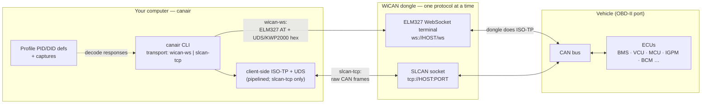

# canair

**CLI for reverse engineering CAN/OBD diagnostics over-the-air using a WiCAN dongle**


canair interfaces with a [WiCAN](https://www.meatpi.com/products/wican-pro) OBD-II WiFi dongle to talk to a vehicle's ECUs over UDS and KWP2000. It discovers, decodes, analyzes and documents a car's internal diagnostic data — turning it into a [WiCAN vehicle profile](https://meatpihq.github.io/wican-fw/config/automate/new_vehicle_profiles) or shareable documentation.

Everything ships as a single installable CLI, **`canair`**. Vehicle data lives in a *profile* bundle; the repo ships `profiles/ioniq-2017/` (a 2017 Hyundai Ioniq Electric) as the default/example. The tooling itself is vehicle-agnostic — create your own profile with `canair profile create`.

**Both the WiCAN Pro and the regular (classic, non-Pro) WiCAN are supported.** All the core reverse-engineering — query, scan, discover, decode, DTCs, sniff, and generating AutoPID JSON — works on both over the default raw-SLCAN transport. A few features are **Pro-only**: AutoPID profile device sync (`canair wican autopid upload`/`download`/`diff`), `canair wican mode set`, and the `wican-ws` ELM327 WebSocket transport. Set `wican_model: classic` in your config and canair cleanly refuses those with a helpful message instead of failing against the device.

| | |
|---|---|
|  | Analyzing/decoding a captured signal with `canair decode <query> --plot` |
|  | Byte-level capture diffs with `canair captures <query> --diff` (also the default view for `canair query` on a live vehicle) |

## How it connects

`canair` never talks CAN directly — it reaches the bus through the WiCAN dongle via one of two **explicitly-selected transports** (config `transport:` block or `--transport`; the device runs one protocol at a time — check with `canair status`):

- **`slcan-tcp`** (default) — a raw SLCAN frame stream over TCP (any WiCAN or gateway; device in `slcan` mode). canair performs ISO-TP + UDS itself, pipelined across ECUs. Also powers `canair sniff`.
- **`wican-ws`** (Pro only) — the WiCAN Pro's ELM327 emulation over a WebSocket; the *dongle* performs ISO-TP.



Either way, ECU responses are parsed and decoded into named parameters using the active profile's PID/DID definitions.

**Protocols:** UDS (ISO 14229) for body/comfort ECUs; KWP2000 (ISO 14230) for powertrain ECUs (BMS, VCU, MCU, OBC); ISO-TP (ISO 15765-2) for multi-frame transport; SLCAN-over-TCP and ELM327 AT for the host↔dongle link.

## Commands

All functionality is exposed as `canair <subcommand>`; run `canair <cmd> --help` for details.

| Subcommand | Purpose |
|--------|---------|
| `canair query` | Send UDS/KWP2000 requests to ECUs — parameter queries, positional query steps (multi-ECU pipeline), live `--monitor`. Companions: `discover`, `io` (IOControl actuation), `routines`, `raw`, `repl`. |
| `canair scan` | Probe DID/routine/iocontrol/session ranges for responses. |
| `canair dtc` | Read stored Diagnostic Trouble Codes (`0x19`/`0x18`) for one ECU or `--all`, report changes since the last scan, or clear fault memory (`--clear`, `0x14`). |
| `canair identity` | Decode ECU identity DIDs — part number, hardware/software version, serial, VIN. |
| `canair sniff` | Passive CAN-bus sniffer (raw SLCAN): live per-ID table + optional `.asc`/`.blf`/`.csv` logging. |
| `canair decode` | Value-centric decoding of captures — value ranges, `--stats`, correlation (`--corr`), an interactive signal explorer (`--plot`), and candidate-expression testing (`--try`). |
| `canair captures` | Search/diff/step through saved captures; `--summary`, `--latest`, date scoping. |
| `canair coverage` | Audit PID definitions for decoding gaps (unmapped bytes, partial bitfields, no-capture PIDs). |
| `canair research` | Report the open reverse-engineering backlog from per-ECU `research:` sections. |
| `canair pids` | Add/update `ecus/` parameters and research entries (comment-preserving, schema-validated). |
| `canair wican` | Generate the WiCAN AutoPID profile JSON from `ecus/*.yaml`; upload/download/diff (Pro) and `mode set` (Pro). |
| `canair profile` | Manage profile bundles — `create`/`list`/`show`/`path`. |
| `canair ecu` | List ECUs, or show one ECU's identity confidence and PID/parameter/capture stats. |
| `canair status` | Snapshot of the configured transport, device mode, and reachability. |
| `canair config` | View/manage user config (`~/.config/canair/config.yaml`). |
| `canair validate` | Validate `ecus/`, `profile.yaml`, and `captures/` against their schemas. |

> Separate package [`wican-cli`](https://github.com/philipkocanda/wican-cli) handles WiCAN *device* management (config, sleep/power, status, reboots). `pip install wican-cli`.

## Getting started

You need a **WiCAN dongle** (Pro *or* classic), a car with an OBD-II port, and [`uv`](https://docs.astral.sh/uv/).

### 1. Connect to the dongle

Plug the WiCAN into the OBD-II port and power on ignition/accessory. Get your computer on the same network — either join the WiCAN's built-in `WiCAN_xxxx` WiFi access point (reachable at `192.168.80.1`, canair's default when no config exists), or put the WiCAN on your home WiFi via its web UI so it gets a normal LAN IP.

### 2. Install

canair isn't published to PyPI yet, so install from a clone of this repo:

```bash
git clone https://github.com/philipkocanda/canair.git
cd canair
uv tool install .    # install the `canair` CLI globally
canair --help        # first run auto-creates ~/.config/canair/ + a starter config.yaml
```

(For a quick try without installing, `uv run canair …` works from the repo checkout. For development, use `uv sync`.)

### 3. Configure your device

Edit `~/.config/canair/config.yaml` (created on first run) or use `canair config set`:

```bash
canair config set wican_addresses.home 192.168.1.100
canair config set default_wican home

# Tell canair which hardware you have (default is `pro`):
canair config set wican_model classic   # regular / non-Pro WiCAN
```

The `--wican home|vpn|<ip>` flag on any command selects which device address to use. `config.example.yaml` documents every key. Confirm with:

```bash
canair config        # config locations, WiCAN model + addresses, transport
canair status        # what am I talking to, in what mode, is it usable?
```

### 4. Read something

```bash
canair query BMS:2101              # read the battery ECU's main PID
canair discover                    # list every ECU responding on the bus
```

### 5. (Optional) Tab-completion

Covers subcommands, flags, and ECU/PID names from the active profile:

```bash
canair completion --install    # auto-detects your shell; open a new shell afterwards
```

Through `uv run` the completion won't fire (it hooks the `canair` command word); activate the venv first with `uv sync && source .venv/bin/activate`, then install.

## Usage examples

Roughly the order you'd work through them coming to the project fresh — confirm the connection, see what's on the bus, read data, then dig deeper.

```bash
# Is the device reachable and in a usable mode?
canair status

# See every ECU responding on the bus
canair discover

# Read one ECU's main PID, then all its known parameters (decoded)
canair query BMS:2101
canair query BMS

# Read specific named parameters across ECUs
canair query --param SOC_BMS BATTERY_VOLTAGE BATTERY_POWER

# Watch a value live — refreshes and highlights changed bytes
canair query BMS:2101 --monitor

# Read Diagnostic Trouble Codes across every ECU (logs changes since last scan)
canair dtc --all

# Save what you read for later analysis (prompts for context on exit)
canair query BMS --save

# Analyze the captures you've collected
canair captures BMS --summary       # what have I captured?
canair captures BMS:2101 --diff     # byte-level diff across captures
canair decode BMS 2101 --stats      # value ranges/stats per parameter

# Dig into unknowns: scan an ECU for undocumented DIDs
canair scan 7E4 --service 22 --range BC00-BCFF

# Actuate hardware via IOControl (auto-releases when the session ends)
canair io IGPM                       # interactive TUI
canair io IGPM --did BC01            # turn on low beam (hold until Ctrl+C)

# Multi-step pipeline over one session: wake SKM, then read two ECUs
canair query "skm-wake acc" "query IGPM:BC03" "query BCM:C00B"

# Passively sniff broadcast frames the request/response path can't see
canair sniff --duration 10 --save bus.asc
```

Live query commands accept `--wican home|vpn|<ip>`, `--transport slcan-tcp|wican-ws`, `--json`, and `--reboot` (restore AutoPID mode after a session).

### Query mini-language

`canair query` (and the capture/decode tools) select ECUs and PIDs with a small syntax. A **selector** is `ECU[:PIDLIST]`:

| Selector | Meaning |
|----------|---------|
| `BMS` | all known PIDs for BMS |
| `BMS:2101` | BMS PID `2101` only |
| `IGPM:BC03,BC06` | two IGPM DIDs (comma-separated) |
| `VCU:2101 BMS:2101` | cross-ECU — a **space separates independent selectors** |

> **Bind each PID to its ECU with a colon, never a space.** `IGPM 22BC07` means "all of IGPM **plus** a bogus ECU `22BC07`" — write `IGPM:22BC07`. A bare PID in the ECU slot is rejected with a hint.

`canair query` also accepts a **pipeline** of steps (each a quoted string), run in order over one session. A bare selector is shorthand for a `query` step. Step verbs: `query`, `session <ECU> [--wake]`, `skm-wake [acc|ign1|ign2]`, `raw <TX:PID>`, `scan`, `iocontrol`, `security`, `sleep`, `repl`.

```bash
canair query "session IGPM --wake" "query IGPM:BC03,BC06"
```

> **Keeping a session alive is automatic — there is no `tester-present` command or flag.** Once a `session <ECU>` step (or any command's `--session`) opens an extended diagnostic session, canair keeps it alive by sending TesterPresent (`3E00`) whenever the session goes idle past the S3 timeout; real request traffic resets that timer, so a hot polling loop injects no redundant keepalives. TesterPresent (SID `0x3E`, sub-function `0x00`) is shared by UDS and KWP2000, so it is sent identically regardless of the ECU's protocol. To send one by hand, use a query step (`canair query BMS:3E00`); for a manual repeating loop, the `repl`'s `!tester [id]` command still exists.

## Profiles

A *profile* bundles one vehicle's data — `ecus/` (one file per ECU, the single source of truth for its identity, probe log, DTC meanings, and parameters), `profile.yaml`, `captures/`, `references/`, and generated `out/`. The repo ships `profiles/ioniq-2017/` as the default.

```bash
canair profile list
canair profile create <name> --car-model "..." [--set-default]
```

**Selection precedence** (first match wins): `--profile NAME|PATH` → `CANAIR_PROFILE` env var → `default_profile` in config → the single discovered profile.

**Discovery** searches, in order: `--profiles-dir`, `$CANAIR_PROFILES_DIR`, `profiles_dir` in config, `~/.config/canair/profiles/` (user, uncommitted), then the repo's bundled `profiles/`. User profiles shadow bundled ones by name and are **not** committed.

## The bundled Ioniq profile

The `ioniq-2017` profile makes canair a ready-to-use diagnostics toolkit for the **2017 Hyundai Ioniq Electric (28 kWh, `AE` platform)** — read live battery, motor, charging, climate, and body data over WiFi with no dealer tools. It maps **30 ECUs** and ~**289 parameters** (most verified), including:

- Battery SOC / voltage / current / power, all 96 individual cell voltages, and State of Health
- Motor gear, torque, and temperatures; vehicle speed and **individual wheel speeds** (FL/FR/RL/RR, from the ESC module)
- Charging state (AC / DC CCS) and charge-port lock; the **CCM** (Charge Control Module, PLC for DC fast-charging) is identified on the bus
- Electric power steering (EPS), including a **steering-angle** signal (defined as a strong but still-unverified candidate)
- Tyre pressures/temperatures, HVAC/climate state, and body controls (locks, trunk, lights, indicators)

It also defines **IOControl** actuators (UDS `0x2F`) for hardware you can safely toggle — lights, horn, locks, charge-cable lock, mirrors, wipers (all auto-release when the session ends). The IGPM actuators work from deep sleep with `--wake`. See the per-ECU files (`ecus/igpm.yaml`, `bcm.yaml`, …) for the full, verified list.

## License

Public domain — see [LICENSE](LICENSE) (Unlicense).

## Warning

Interacting with your vehicle's CAN bus and ECUs can damage your car, trigger faults, or leave it in an unsafe state. **Use this software entirely at your own risk.** You are solely responsible for any consequences.
