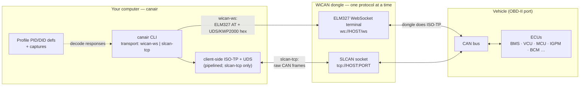

# canair

**CLI for reverse engineering CAN/OBD diagnostics over-the-air using a WiCAN dongle**

This project interfaces with a [WiCAN](https://www.meatpi.com/products/wican-pro) OBD-II WiFi dongle to communicate with the vehicle's ECUs via diagnostic protocols (UDS and KWP2000). It comes with tools for discovering, decoding, analyzing and documenting the car's internal diagnostic data so it can be turned into a [WiCAN vehicle profile](https://meatpihq.github.io/wican-fw/config/automate/new_vehicle_profiles) or for general purpose sharing and documentation.

**Both the [WiCAN Pro](https://www.meatpi.com/products/wican-pro) and the regular (classic, non-Pro) WiCAN are supported.** All the core reverse-engineering — querying, scanning, decoding, DTCs, sniffing — works on both over the default raw-SLCAN transport. A few features are **Pro-only**: uploading/downloading AutoPID [vehicle profiles](https://meatpihq.github.io/wican-fw/config/automate/new_vehicle_profiles) (`canair wican` device sync) and the `wican-ws` ELM327 WebSocket terminal. If you have the regular WiCAN, set `wican_model: classic` in your config (see [Getting started](#getting-started)) and canair will cleanly disable those instead of failing against the device.

Everything ships as a single installable CLI, **`canair`**. Vehicle data lives in a *profile* bundle; the repo ships `profiles/ioniq-2017/` as the default/example profile.
Originally this project was built for reverse engineering a 2017 Hyundai Ioniq AE EV (28kWh), but it now supports multiple vehicle profiles and is no longer tied to a single vehicle.

Some highlights of this project's features:


Example screenshot of analyzing/decoding a captured signal using `canair decode <query> --plot`


Example screenshot of stepping through captures one by one using `canair captures <query> --step`


Example screenshot of viewing capture diffs using `canair captures <query> --diff`. Green/yellow represents PID verification state, changed bytes are highlighted between frames. This byte diff view is the default then using `canair query` on a live vehicle.

-----

### What's in the box

- 🔌 **`canair query`** — query ECUs live over WiFi or VPN: read battery stats, decode parameters, scan for unknown DIDs, and actuate hardware (lights, locks, horn, trunk) via IOControl. Companions: `canair scan`/`discover`/`io`/`routines`/`identity`/`raw`/`repl`
- 🩺 **`canair dtc`** — read stored Diagnostic Trouble Codes (DTCs) across every ECU (UDS `0x19` / KWP2000 `0x18`), track what changed since the last scan, and clear fault memory (`0x14`)
- 📡 **`canair sniff`** — passive CAN-bus sniffer (raw SLCAN mode): a live per-ID table of broadcast frames the request/response path can't see, with optional `.asc`/`.blf`/`.csv` logging
- 📦 **`canair wican`** — turn YAML PID definitions into a WiCAN vehicle profile and upload it to the device in one command (device upload/download needs a WiCAN **Pro**; JSON generation works on any model)
- 🔬 **`canair decode`** — replay captured UDS payloads against PID definitions to validate expressions and spot anomalies
- 🗂️ **`canair captures`** — search and diff historical captures across dates and vehicle states
- 🧮 **`canair bix`** — convert between the four byte-index notations used by WiCAN, ISO-TP, Torque, and OBDb
- 🔎 **`canair ecu` / `canair status` / `canair config`** — inspect the ECU registry & per-ECU stats, check the transport/device mode, and manage user configuration
- 📐 **`profiles/ioniq-2017/ecus/`** — one YAML file per ECU (30 files), each the single source of truth for that ECU: identity, probe log, DTC meanings, and all parameters

## Hyundai Ioniq 2017 Electric (28 kWh) — what `canair` reads & controls

While the tooling is vehicle-agnostic, the bundled `ioniq-2017` profile makes this
a practical, ready-to-use **OBD-II / UDS diagnostics toolkit for the 2017 Hyundai
Ioniq Electric (28 kWh, `AE` platform)**. Plug in a WiCAN (Pro or regular) and
you can read live battery, motor, charging, climate, and body data over WiFi —
no dealer tools required. If you own an Ioniq 28 kWh and want deeper telemetry
than a generic OBD app provides, this profile is for you.

### What's been mapped so far

- **30 ECUs** discovered on the CAN bus (27 with PID definitions; 3 identity-only)
- **289 parameters** defined (215 verified), including:
  - Battery SOC (State of Charge), voltage, current, power
  - All 96 individual cell voltages
  - State of Health (SOH) and cumulative lifetime energy
  - Tyre pressures and temperatures
  - HVAC / climate control state and interior temperatures
  - Gear, vehicle speed, motor speed, torque, and temperatures
  - Charging state (AC / DC / CCS) & charge port lock
  - Door locks, trunk, lights, indicators
  - Ambient temperature

## Project structure

```
├── canlib/                     # The canair CLI + shared library
│   ├── cli.py                  #   argparse entrypoint — the `canair` command
│   ├── commands/               #   one module per subcommand (query, scan, decode, captures, wican, bix, …)
│   ├── elm327.py               #   ELM327 / ISO-TP protocol parsing
│   ├── expression.py           #   WiCAN expression evaluator (Bnn, Snn notation)
│   ├── session_manager.py      #   UDS session management
│   ├── terminal.py             #   WebSocket terminal interface
│   ├── modes/                  #   query sub-modes (scan, interactive, IOControl, etc.)
│   └── schema/                 #   tool-owned schemas: pids_schema.yaml, captures_schema.json, states_schema.yaml
│
├── profiles/                   # Vehicle profile bundles (each = one car's data)
│   └── ioniq-2017/             #   bundled default/example profile
│       ├── ecus/               #     One file per ECU — the single source of truth
│       │   ├── bms.yaml        #       BMS: identity, scan_log, dtcs, pids (largest — 147 params)
│       │   ├── vcu.yaml        #       Vehicle Control Unit
│       │   ├── mcu.yaml        #       Motor Control Unit
│       │   ├── amp.yaml        #       Audio Amplifier (identity-only — no pids:)
│       │   └── ... (30 ECU files total)
│       ├── profile.yaml        #     Profile-wide settings: car_model, init, failure_types
│       ├── captures/           #     Raw UDS response payloads by date
│       ├── references/         #     Reference material (other-vehicle logs, spreadsheets)
│       ├── dtc_log.yaml        #     History of DTC scans (written by `canair dtc`)
│       └── out/                #     Generated WiCAN JSON profiles
│
├── config.example.yaml         # Template for ~/.config/canair/config.yaml
├── configs/                    # WiCAN device config backups
├── logs/                       # Command/response logs (gitignored)
└── tests/                      # pytest test suite
```

Local (uncommitted) profiles live in `~/.config/canair/profiles/` and shadow bundled ones by name.

Each profile's `references/` directory (e.g. `profiles/ioniq-2017/references/`) contains earlier CarScanner captures, reference spreadsheets, and cross-reference material from related vehicles (Kona, Kia Soul EV).

## Key tools

All functionality is exposed as `canair <subcommand>`.

| Subcommand | Purpose |
|--------|---------|
| `canair query` | Send UDS/KWP2000 requests to ECUs over the configured transport (raw `slcan-tcp` by default, or the `wican-ws` WebSocket ELM327 terminal). Supports parameter queries, positional query steps (multi-ECU pipeline), monitoring, and more. Companions: `canair scan` (DID scanning), `canair discover`, `canair io` (IOControl actuation), `canair routines`, `canair raw`, `canair repl` (interactive). |
| `canair dtc` | Read stored Diagnostic Trouble Codes (UDS `0x19` / KWP2000 `0x18`) for one ECU or `--all`, log each scan to `dtc_log.yaml` and report what changed since the last scan, or clear fault memory with `--clear` (`0x14`). |
| `canair identity` | Query and decode ECU identity data — part number, hardware/software version, serial, VIN — via UDS (`22 F1xx`) or KWP2000 (`1A 8x/9x`); protocol auto-selected from the registry. |
| `canair sniff` | Passive CAN-bus sniffer (raw SLCAN-over-TCP). Live per-ID table (count/rate/last data/changed bytes) for discovering broadcast IDs the request/response path can't see; optional `.asc`/`.blf`/`.csv` frame logging. |
| `canair wican` | Read all `ecus/*.yaml` definitions and produce a WiCAN-compatible JSON vehicle profile. Can upload directly to the device, diff against the current config, or switch the device protocol (`--set-protocol`). |
| `canair decode` | Parameter/value-centric decoding: shows each PID parameter's value range across all captures (default), plus statistics (`--stats`), correlation vs a reference signal (`--corr`), an interactive signal explorer (`--plot` — sweep ImHex-style byte interpretations and transforms, plot across captures), and candidate-expression testing without editing YAML (`--try`). |
| `canair captures` | Search across all capture files — show summaries, diffs between dates, or latest values per ECU/PID. Scope any mode by date with `--since`/`--until`/`--date`. |
| `canair research` | Report the open reverse-engineering backlog from the per-ECU `research:` sections (by type/status/priority/prerequisite). The "what should I decode next?" entry point. |
| `canair coverage` | Audit PID definitions for decoding gaps — unmapped data bytes, partial bitfields, and PIDs with no captures yet. |
| `canair pids` | Safely add/update `ecus/` parameters and research entries from the CLI (comment-preserving, schema-validated, auto-reverted on failure). |
| `canair ecu` | List all ECUs in the profile, or show one ECU's details, identity confidence, and PID/parameter/capture stats. |
| `canair status` | Read-only snapshot of the configured transport, device mode, and reachability — "what am I talking to, in what mode, is it usable?" |
| `canair config` | View and manage user configuration (`~/.config/canair/config.yaml`) — `show`/`get`/`set`/`unset`/`edit`, comment-preserving. Set `wican_model` (`pro`/`classic`), WiCAN addresses, default profile, and transport here. |
| `canair validate` | Validate `ecus/`, `profile.yaml`, and `captures/` against their schemas; `--stats` prints ECU/PID/parameter/verified counts. |
| `canair tester-present` | Send TesterPresent (`3E00`) at a fixed interval to keep a diagnostic session alive. |
| [`wican-cli`](https://github.com/philipkocanda/wican-cli) | Separate package for WiCAN device management — config, sleep/power, protocol switching, status, OBD log queries, and reboots. Install with `pip install wican-cli`. |

## Profiles

A *profile* is a directory bundling one vehicle's data — `ecus/` (one file per ECU), `profile.yaml`, `captures/`, `references/`, and generated `out/`. The repo ships `profiles/ioniq-2017/` as the default/example profile. Inspect profiles with `canair profile list`, `canair profile show [NAME]`, and `canair profile path [NAME]`.

Start a new vehicle from scratch with `canair profile create <name> --car-model "..."`, which scaffolds an empty bundle (`profile.yaml`, an empty `ecus/`, `captures/`, `out/`) under `~/.config/canair/profiles/<name>` (or `--path DIR`). Add `--set-default` to make it the default. Validate any time with `canair validate`.

**Selection precedence** (first match wins): `--profile NAME|PATH` (global flag, before the subcommand) → `CANAIR_PROFILE` env var → `default_profile` in config → the single discovered profile (auto).

**Discovery** searches, in order: `--profiles-dir`, `$CANAIR_PROFILES_DIR`, `profiles_dir` in config, `~/.config/canair/profiles/` (user, uncommitted), and the repo's bundled `profiles/`. User profiles shadow bundled ones by name. Local profiles live in `~/.config/canair/profiles/` and are **not** committed.

## Querying captures

`canair captures` searches across all saved UDS response captures (in the profile's `captures/`) and displays them with context — timestamps, vehicle state, notes, and decoded parameter values (computed on the fly from the PID definitions, not stored in the capture files) where those definitions exist.

```bash
canair captures BMS                 # All captures for the BMS ECU
canair captures IGPM 22BC03         # Specific ECU+PID (most useful)
canair captures "BMS:2102,2103"     # Several PIDs (query mini-language)
canair captures --summary           # Overview: captures per ECU, per date
canair captures --latest BMS        # Most recent payload per BMS PID
canair captures IGPM 22BC03 --diff  # Byte-level diff (highlights changed bytes)
canair captures BMS 2102 --step     # Interactively step through captures
```

**Example output** (`canair captures BMS` shows 278 captures across multiple dates):

```
BMS — 278 captures

2026-04-17 16:43:21  (ready)
  PID: 2101
  Payload: 6101FFFFFFFF8C264826480300080E720F0E0E0E0F0F0E0010C00DC001000091...
  SOC_BMS: 70.0 %
  BATTERY_POWER: 0.3 kW
  BATTERY_VOLTAGE: 369.8 V

2026-04-17  (ready)
  PID: scan
  Scan: 0 responding, BC01-BC0B (11 DIDs): all NRC 0x31.
  Notes: No service 22 DIDs found beyond existing 21xx PIDs

2026-04-17  (ready)
  PID: 1A90
  Response: AEEV__ BMS
  Notes: ECU name
```

Captures are saved by `canair query --save` during scanning, raw queries, and monitor sessions. You will be prompted to provide context on the scan when done. Use `canair captures` and `canair decode` after collecting new data to spot patterns not obvious during the live session (byte-level changes between vehicle states, new ECU/PID combinations, payload length differences).

## Generating WiCAN vehicle profile

`canair wican` reads all PID definitions from the profile's `ecus/*.yaml` and produces a WiCAN-compatible JSON vehicle profile. It can also upload directly to the device or diff against the currently loaded config.

```bash
canair wican                    # Generate JSON to the profile's out/profile.json
canair wican --verified-only    # Only include verified parameters (113 vs 147 total)
canair wican --no-write         # Dry run — show what would be generated without writing
canair wican --stats            # Show per-ECU/PID statistics table
canair wican --download         # Download current config from WiCAN device
canair wican --diff             # Download + diff against locally generated profile
canair wican --upload           # Generate + upload to WiCAN device
canair wican --upload --reboot  # Upload + reboot device to apply changes
canair wican --set-protocol slcan   # Switch device protocol/mode (reboots)
```

**Example output** (default mode):

```
Loading profiles/ioniq-2017/ecus/

Generating profile...
  18 PID groups, 147 parameters

Writing output...
  Written: profiles/ioniq-2017/out/profile.json (6530 bytes)
```

**`--stats` mode** shows a detailed breakdown per ECU and PID — parameter counts, verification status, polling period, and data source:

```
ECU        TX ID    PID        Period   Params   Verified   Source Summary
────────────────────────────────────────────────────────────────────────────────
BMS        0x7E4    2101       2500     32       32/32      AutoPID config (on device); bitfield...
BMS        0x7E4    2105       5000     19       18/19      Original WiCAN config
BMS        0x7E4    2102       10000    32       32/32      ImHex pattern
IGPM       0x770    22BC03     2500     16       14/16      Decoded from live captures
HVAC       0x7B3    220100     5000     12       6/12       Fan speed test 2026-04-19
VCU        0x7E2    2101       2500     21       10/21      AutoPID config (on device); ITStromer...
...
```

**Device interaction flags** (`--download`, `--diff`, `--upload`, `--set-protocol`) require the WiCAN to be reachable on the network. Use `--wican home`, `--wican vpn`, or `--wican <ip>` to select the device address (defaults to your `default_wican` from `~/.config/canair/config.yaml`).

> **WiCAN Pro only.** AutoPID vehicle-profile sync (`--upload`/`--download`/`--diff`) and `--set-protocol` need a WiCAN **Pro**. On the regular WiCAN (`wican_model: classic` in your config) these are refused with a clear message — but plain `canair wican` (generate JSON), `--stats`, and `--no-write` still work. See [Getting started](#getting-started).

The generated profile uses the **Vehicle Profile format** (grouped parameters per PID) — the format accepted by the WiCAN web UI and `POST /store_car_data`. The tool handles conversion to the device's internal array format automatically during upload.

## IOControl — what can be remotely controlled

Beyond reading diagnostic data, the toolkit can **actuate** vehicle hardware via UDS IOControlByIdentifier (service `0x2F`). All actuators auto-release when the diagnostic session ends (Ctrl+C or timeout) — no permanent state changes.


### IGPM (Integrated Power Gate Module, `0x770`)

Works from deep sleep with `--wake`. No ACC/IGN required.

| Category | Actuators |
|----------|-----------|
| Lights | Low beam, high beam, DRL, tail lights, rear fog, left/right indicators, rear brake lights (L/R), CHMSL, luggage lamp |
| Horn | Horn |
| Locks | Door lock all, door unlock all, trunk release |
| Charge cable | Cable lock, cable unlock |

### BCM (Body Control Module, `0x7A0`)

Requires extended session + SKM ACC power.

| Category | Actuators |
|----------|-----------|
| Mirrors | Fold, unfold |
| Interior | Room lamp, puddle lights, heated steering wheel + LED |
| Wipers | Wiper motor (slow/fast) |
| Sensors | Parking sensor buzzer |
| Warnings | Seatbelt warning (driver + 3 passengers) |

### SKM (Smart Key Module, `0x7A5`)

Requires keyfob proximity for physical relay engagement.

| Relay | Effect |
|-------|--------|
| ACC (`B108`) | Turns on accessories, dash, infotainment, unlocks doors |
| IGN1 (`B109`) | Wakes HV system (untested, use with caution) |

### HVAC (`0x7B3`) — work in progress

14+ actuator DIDs discovered but unverified. Goal: remote cabin pre-conditioning (heat/cool before driving). Research ongoing.

### Where IOControl commands are defined

- **Per-ECU YAML files:** `profiles/ioniq-2017/ecus/igpm.yaml`, `bcm.yaml`, `skm.yaml`, `hvac.yaml`, `vess.yaml`, `psm.yaml` — source of truth for all actuator definitions, parameters, and verification status.
- **IOControl mode implementation:** `canlib/modes/iocontrol.py` — TUI-based interactive actuator control and single-command execution.
- **Quick reference docs:** `docs/IOControl CLI commands.md` — copy-paste command examples.

## How the CLI works

`canair` is an async Python CLI (argparse subcommands) that reaches the vehicle bus through the WiCAN dongle over one of two transports — a raw `slcan-tcp` CAN stream (default; ISO-TP + UDS run client-side) or the `wican-ws` WebSocket ELM327 terminal — and sends UDS/KWP2000 requests over ISO-TP. `canair query` (and its sibling subcommands) drive the live communication.

**Architecture:**

```
canair (canlib/cli.py — argparse + argcomplete)
  └── canlib/
      ├── commands/          # one module per subcommand (query, scan, io, wican, …)
      ├── terminal.py        # WebSocket connection (WiCANTerminal)
      ├── elm327.py          # ELM327/ISO-TP protocol parsing
      ├── session_manager.py # Multi-ECU sessions + TesterPresent keepalive
      └── modes/             # sub-mode implementations (scan, monitor, iocontrol, routines, dtc, identity, …)
```

**Key modes:**

| Mode | Command | Purpose |
|------|------|---------|
| Parameter query | `canair query --param NAME` / `canair query ECU` | Decode named parameters from YAML definitions |
| IOControl | `canair io ECU [--did DID]` | Interactive TUI or single actuator command |
| Query pipeline | `canair query "CMD" "CMD" ...` | Sequenced query steps (multi mini-language) with session management |
| Scan | `canair scan ECU --service SVC --range START-END` | Probe DID ranges for responses |
| Raw | `canair raw TX:PAYLOAD` | Direct hex request (no decoding) |
| Routines | `canair routines ECU` | RoutineControl (0x31) TUI |
| DTCs | `canair dtc ECU` / `canair dtc --all` | Read/clear Diagnostic Trouble Codes (0x19 / 0x18 / 0x14) |
| Identity | `canair identity ECU` | Decode ECU identity DIDs (part no., version, serial, VIN) |
| Monitor | `canair query "..." --monitor [SEC]` | Live-refreshing poll loop |

**Cross-cutting flags** (shared by the live query commands): `--session`, `--wake`, `--save` (`--label`/`--state`/`--notes`), `--wican home|vpn|IP`, `--transport slcan-tcp|wican-ws`, `--elm-timeout`, `--json`, `--verbose`, `--reboot`, `--unsafe`, `--force`

## Usage examples

```bash
# Read specific parameters (decoded output)
canair query --param SOC_BMS BATTERY_VOLTAGE BATTERY_POWER

# Query all parameters for an ECU (or a single PID)
canair query BMS
canair query BMS:2101

# Live monitor — refresh every 5 seconds and highlight changes
canair query BMS:2101 --monitor

# Wake a sleeping ECU and query it
canair query "session IGPM --wake" "query IGPM:BC03,BC06"

# IOControl — interactive TUI for actuators
canair io IGPM
# Or single command: turn on low beam (hold until Ctrl+C)
canair io IGPM --did BC01

# Scan for unknown DIDs on an ECU
canair scan 7E4 --service 22 --range BC00-BCFF

# Discover all responding ECUs on the bus
canair discover

# Discover and auto-register new ECUs into ecus/ (--dry-run to preview)
canair discover --register

# Raw UDS request (hex in, hex out)
canair raw 7E4:2101

# Monitor + capture unique payloads, save on exit
canair query BCM:C00B --monitor --keep-unique --save

# Multi-ECU pipeline: wake SKM, query IGPM and BCM
canair query "skm-wake acc" "query IGPM:BC03" "query BCM:C00B"

# Read Diagnostic Trouble Codes across every ECU (logs changes since last scan)
canair dtc --all

# Decode an ECU's identity (part no., version, serial, VIN)
canair identity IGPM --session

# Passively sniff the CAN bus (device must be in slcan mode)
canair sniff --duration 10 --save bus.asc
```

The live query commands accept `--wican home|vpn|<ip>` to select the target device, `--transport slcan-tcp|wican-ws` to pick the transport, `--json` for machine-readable output, and `--reboot` to restore AutoPID mode after a session.

### Query mini-language

`canair query` (and the capture/decode tools) select ECUs and PIDs with a small
selection syntax. A **selector** is `ECU[:PIDLIST]`:

| Selector | Meaning |
|----------|---------|
| `BMS` | all known PIDs for BMS |
| `BMS:2101` | BMS PID `2101` only |
| `IGPM:BC03,BC06` | two IGPM DIDs (comma-separated PID list) |
| `VCU:2101 BMS:2101` | cross-ECU — a **space separates independent selectors** |

> **Bind each PID to its ECU with a colon, never a space.** In a query a space
> separates independent ECU selectors, so `IGPM 22BC07` means "all of IGPM **plus**
> a (bogus) ECU named `22BC07`" — not IGPM's PID `22BC07`. Write `IGPM:22BC07`.
> `canair query` rejects a bare PID/DID in the ECU slot with a hint to the colon form.

`canair query` also accepts a **pipeline** of steps (each a quoted string), run in
order over one session. A bare selector is shorthand for a `query` step, so
`canair query BMS:2101` == `canair query "query BMS:2101"`. Step verbs:

| Step | Purpose |
|------|---------|
| `query <SELECTORS>` | read ECU parameters/PIDs |
| `session <ECU> [--wake]` | enter an extended diagnostic session |
| `skm-wake [acc\|ign1\|ign2]` | wake the SKM and activate a relay |
| `raw <TX:PID> [--hold]` | raw UDS request |
| `scan <TX> <SVC> <RANGE>` | scan a PID range |
| `iocontrol <ECU> <DID> [--off]` | InputOutputControl |
| `security <ECU>` / `sleep <s>` / `repl` | security access / pause / drop into REPL |

```bash
# Pipeline: wake IGPM, then read two of its DIDs
canair query "session IGPM --wake" "query IGPM:BC03,BC06"
```

### Live monitoring of responses and auto-highlighting changes 

```
canair query IGPM:22BC07 --monitor 2 --keep-unique
```


## Protocols

| Protocol | Used for |
|----------|----------|
| **UDS** (ISO 14229) | Body/comfort ECUs — session control, ReadDataByIdentifier, IOControl, RoutineControl |
| **KWP2000** (ISO 14230) | Powertrain ECUs (BMS, VCU, MCU, LDC/OBC) — ReadDataByLocalIdentifier |
| **ISO-TP** (ISO 15765-2) | Transport layer for multi-frame CAN messages (run client-side on `slcan-tcp`, or by the dongle on `wican-ws`) |
| **SLCAN over TCP** | Default host↔dongle link — raw CAN frame stream (device in `slcan` mode) |
| **ELM327 AT commands** | Alternative host↔dongle link — the WiCAN Pro's WebSocket ELM327 emulation (`wican-ws` transport; Pro only) |

## Getting started

New here? Follow these steps in order. You need a **WiCAN dongle** (Pro *or*
regular/classic), a car with an OBD-II port, and [`uv`](https://docs.astral.sh/uv/)
installed.

### 1. Plug in and connect to the dongle

Plug the WiCAN into your car's OBD-II port and power the ignition/accessory on.
Get your computer on the same network as the dongle — either:

- **Join the WiCAN's built-in WiFi access point** (easiest to start): connect to
  its `WiCAN_xxxx` WiFi network. The device is then reachable at `192.168.80.1`
  (this is canair's default when no config exists), **or**
- **Put the WiCAN on your home WiFi** (via its web UI at `192.168.80.1`) so it
  gets a normal LAN IP you can reach from your computer or over a VPN.

### 2. Install canair

```bash
uv tool install .    # Install the `canair` CLI globally
canair --help        # First run auto-creates ~/.config/canair/ + a starter config.yaml
```

(No global install needed for a quick try — `uv run canair …` works from the
repo. For development use `uv sync` instead.)

### 3. Tell canair about your device

canair created `~/.config/canair/config.yaml` on first run. Edit it (or use
`canair config set …`) to set your device address and — importantly — **which
WiCAN model you have**:

```bash
# If your device is on your LAN/VPN, add an address and make it the default:
canair config set wican_addresses.home 192.168.1.100
canair config set default_wican home

# Tell canair which hardware you have (skip this if you have a WiCAN Pro):
canair config set wican_model classic   # regular / non-Pro WiCAN
# canair config set wican_model pro      # WiCAN Pro (this is the default)
```

> **Which model do I have?** The **Pro** adds AutoPID vehicle profiles and an
> ELM327 WebSocket terminal. If you have the **regular (classic) WiCAN**, set
> `wican_model: classic` — canair will then cleanly refuse the Pro-only features
> (`canair wican --upload/--download/--diff/--set-protocol` and the `wican-ws`
> transport) with a helpful message instead of failing against the device. **All
> the reverse-engineering — `query`, `scan`, `discover`, `decode`, `dtc`,
> `sniff`, and generating profile JSON with plain `canair wican` — works on both
> models** over the default raw-SLCAN transport. The `--wican` flag on any
> command selects which address to use (e.g. `--wican home`, `--wican vpn`, or
> `--wican 192.168.80.1`). `config.example.yaml` in the repo documents every key.

Confirm everything resolved correctly:

```bash
canair config        # shows config file locations, WiCAN model + addresses, transport
canair status        # "what am I talking to, in what mode, is it usable?"
```

### 4. Read something

```bash
canair query BMS:2101              # read the battery ECU's main PID
canair discover                    # list every ECU responding on the bus
```

### 5. (Optional) Enable tab-completion

Tab-completion covers subcommands, flags, and ECU/PID names from the active profile:

```bash
canair completion --install    # auto-detects your shell; open a new shell afterwards
```

This writes the completion script into your shell's autoload directory (fish/bash need
no further setup; zsh loads it from a directory on `$fpath`). To wire it up manually
instead, add `eval "$(canair completion zsh)"` to your shell startup file.

**For development** (`uv run canair`, no global install): completion hooks the `canair`
command word, so it won't fire through the `uv run` prefix. Activate the project venv so
`canair` is on your `PATH` directly, then install as above:

```bash
uv sync && source .venv/bin/activate
canair completion --install
```

The WiCAN must be powered on and reachable on the network (or you connect to its
AP). Device addresses live in `~/.config/canair/config.yaml` (a legacy repo-root
`config.yaml` is still read for back-compat). Without a config file, tools default
to `192.168.80.1` (WiCAN's built-in AP).

## How it all connects

`canair` never talks CAN directly — it reaches the vehicle bus through the WiCAN
dongle via one of two **explicitly-selected transports** (config `transport:`
block or `--transport`; the device runs one protocol at a time — check with
`canair status`, switch with `canair wican --set-protocol …`, never automatic):

- **`slcan-tcp`** (default) — a raw **SLCAN** frame stream over TCP (WiCAN Pro,
  classic WiCAN, or any gateway; requires the device in `slcan` mode). *canair*
  performs ISO-TP + UDS itself, with request **pipelining** across ECUs and
  multi-DID batching. Also powers passive `canair sniff`.
- **`wican-ws`** — the WiCAN Pro's **ELM327 emulation** over a WebSocket. The
  *dongle* performs ISO-TP (multi-frame reassembly). Works in any device
  `protocol`. **WiCAN Pro only** — not available on the regular WiCAN (canair
  refuses it when `wican_model: classic`).



**`wican-ws` path:** `canair` opens `ws://HOST/ws`, switches the dongle into
ELM327 terminal mode, and streams ELM327 `AT` commands + UDS/KWP2000 request hex;
the dongle packs them into ISO-TP frames on the CAN bus and returns responses the
same way.

**`slcan-tcp` path:** `canair` opens the SLCAN TCP socket and exchanges *raw* CAN
frames, running its own ISO-TP stack per ECU (`python-can` + `can-isotp`) so it
can pipeline requests across ECUs.

Either way, ECU responses are parsed and decoded into named parameters using the
active profile's PID/DID definitions.

## License

Public domain — see [LICENSE](LICENSE) (Unlicense).
