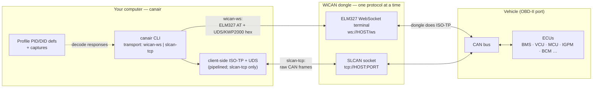
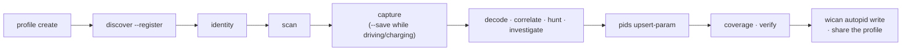

# canair

**CLI for reverse engineering CAN/OBD diagnostics over-the-air using a WiCAN dongle**

[](https://philipkocanda.github.io/canair/)
[](https://github.com/philipkocanda/canair/actions/workflows/ci.yml)
[](LICENSE)


canair interfaces with a [WiCAN](https://www.meatpi.com/products/wican-pro) OBD-II WiFi dongle to talk to a vehicle's ECUs over UDS and KWP2000. It discovers, decodes, analyzes and documents a car's internal diagnostic data — turning it into a [WiCAN vehicle profile](https://meatpihq.github.io/wican-fw/config/automate/new_vehicle_profiles) or shareable documentation.

Everything ships as a single installable CLI, **`canair`**. Vehicle data lives in a *profile* bundle; the repo ships `profiles/ioniq-2017/` (a 2017 Hyundai Ioniq Electric) as the default/example. The tooling is vehicle-agnostic — build one for your car (see [Bring your own car](https://philipkocanda.github.io/canair/bring-your-own-car/overview/)).

**Built for both human *and* agentic use.** Every capability is a composable, scriptable subcommand with structured (`--json`) output, so it works equally well driven by a person at a terminal or by an AI coding agent (e.g. Claude). The reverse-engineering workflows are captured as agent skills in `.claude/skills/`.

**Both the WiCAN Pro and the classic (non-Pro) WiCAN are supported** over the default raw-SLCAN transport. A few features are Pro-only (AutoPID device sync, `wican mode set`, the `wican-ws` transport); set `wican_model: classic` and canair cleanly refuses them. See [connecting your dongle](https://philipkocanda.github.io/canair/getting-started/connect-device/).

> **📖 Documentation:** **[philipkocanda.github.io/canair](https://philipkocanda.github.io/canair/)** —
> [Getting started](https://philipkocanda.github.io/canair/getting-started/install/) · [**Bring your own car**](https://philipkocanda.github.io/canair/bring-your-own-car/overview/) (the full new-vehicle walkthrough) · [Concepts](https://philipkocanda.github.io/canair/concepts/architecture/) · [Reference](https://philipkocanda.github.io/canair/reference/config/). (Source in [`docs/`](docs/index.md).)

| | |
|---|---|
|  | Analyzing/decoding a captured signal with `canair decode <query> --plot` |
|  | Byte-level capture diffs with `canair captures <query> --diff` (also the default view for `canair query` on a live vehicle) |

## How it connects

`canair` never talks CAN directly — it reaches the bus through the WiCAN dongle via one of two explicitly-selected transports: **`slcan-tcp`** (default; raw SLCAN over TCP, any WiCAN, canair does ISO-TP+UDS) or **`wican-ws`** (Pro only; ELM327 over WebSocket, the dongle does ISO-TP).



Responses are decoded into named parameters using the active profile's definitions. See [Architecture](https://philipkocanda.github.io/canair/concepts/architecture/) for the transports, protocols (UDS / KWP2000 / ISO-TP), and the two data domains.

## Commands

All functionality is exposed as `canair <subcommand>`; run `canair <cmd> --help` for details, or see the [CLI reference](https://philipkocanda.github.io/canair/reference/cli/).

| Subcommand | Purpose |
|--------|---------|
| `canair query` | Send UDS/KWP2000 requests — parameter queries, multi-ECU pipelines, live `--monitor`. Companions: `discover`, `io`, `routines`, `raw`, `repl`. |
| `canair scan` | Probe DID/routine/iocontrol/session ranges for responses. |
| `canair dtc` | Read/clear Diagnostic Trouble Codes; report changes since the last scan. |
| `canair identity` | Decode ECU identity DIDs — part number, versions, serial, VIN. |
| `canair sniff` | Passive CAN-bus sniffer (raw SLCAN) with optional frame logging. |
| `canair decode` | Value-centric decoding of captures — stats, correlation, `--plot`, candidate-expression testing. |
| `canair correlate` | Rank the strongest cross-signal relationships across a drive. |
| `canair hunt` | "Which byte *is* this known signal?" — sweep, correlate, fit, unit-guess. |
| `canair investigate` | One-shot per-byte report for an unknown PID. |
| `canair captures` | Search/diff/step through saved captures. |
| `canair coverage` | Audit PID definitions for decoding gaps. |
| `canair research` | Report the open reverse-engineering backlog. |
| `canair pids` | Add/update `ecus/` parameters and research entries (validated). |
| `canair ecu` | Inspect ECUs, or register one offline (`ecu add`). |
| `canair wican` | Generate the WiCAN AutoPID JSON; upload/download/diff (Pro). |
| `canair profile` | Manage profile bundles — create/list/show/path. |
| `canair status` | Snapshot of transport, device mode, and reachability. |
| `canair config` | View/manage user config. |
| `canair validate` | Validate `ecus/`, `profile.yaml`, and `captures/` against their schemas. |

> Separate package [`wican-cli`](https://github.com/philipkocanda/wican-cli) handles WiCAN *device* management (config, sleep/power, status, reboots). `pip install wican-cli`.

## Quick start

You need a **WiCAN dongle** (Pro *or* classic), a car with an OBD-II port, and [`uv`](https://docs.astral.sh/uv/).

```bash
git clone https://github.com/philipkocanda/canair.git
cd canair
uv tool install .                       # install the `canair` CLI
canair config set wican_addresses.home 192.168.1.100
canair config set default_wican home
canair status                           # is the device reachable?
canair discover                         # list every ECU on the bus (any car)
canair query BMS:2101                   # read a PID (Ioniq profile)
```

Full setup — installing, connecting the dongle (Pro vs classic, AP vs LAN), tab-completion, and your first read — is in [Getting started](https://philipkocanda.github.io/canair/getting-started/install/).

> **You don't need to be a CAN expert to start.** Reading is safe and free — canair only *reads* unless you explicitly actuate something, and every state-changing action confirms first. Interacting with a vehicle bus still carries real risk: see the [Warning](#warning).

## Bring your own car

The bundled Ioniq profile is just an *example*. To reverse-engineer *your* car, build your own profile and let the discovery/scan commands populate it as you go:



Each step has a dedicated page under [**Bring your own car**](https://philipkocanda.github.io/canair/bring-your-own-car/overview/): [create](https://philipkocanda.github.io/canair/bring-your-own-car/01-create-profile/) · [discover](https://philipkocanda.github.io/canair/bring-your-own-car/02-discover-ecus/) · [identity](https://philipkocanda.github.io/canair/bring-your-own-car/03-identity/) · [scan](https://philipkocanda.github.io/canair/bring-your-own-car/04-scan/) · [capture](https://philipkocanda.github.io/canair/bring-your-own-car/05-capture/) · [analyze](https://philipkocanda.github.io/canair/bring-your-own-car/06-analyze/) · [define & verify](https://philipkocanda.github.io/canair/bring-your-own-car/07-define-and-verify/) · [share](https://philipkocanda.github.io/canair/bring-your-own-car/08-share/).

## Profiles

A *profile* bundles one vehicle's data — `ecus/` (one file per ECU, the source of truth), `profile.yaml`, `captures/`, `references/`, and generated `out/`. The repo ships `profiles/ioniq-2017/` as the default. Manage them with `canair profile list` / `create`, and select with `--profile` / `CANAIR_PROFILE` / `default_profile`. See [Profiles](https://philipkocanda.github.io/canair/concepts/profiles/) for the layout, precedence, and discovery order.

## The bundled Ioniq profile

The `ioniq-2017` profile makes canair a ready-to-use diagnostics toolkit for the **2017 Hyundai Ioniq Electric (28 kWh, `AE` platform)** — read live battery, motor, charging, climate, and body data over WiFi with no dealer tools. It maps **30 ECUs** and **336 parameters** (~215 verified), including:

- Battery SOC / voltage / current / power, all 96 individual cell voltages, and State of Health
- Motor gear, torque, and temperatures; vehicle speed and **individual wheel speeds** (from the ESC module)
- Charging state (AC / DC CCS) and charge-port lock
- Electric power steering, tyre pressures/temperatures, HVAC/climate, and body controls (locks, trunk, lights, indicators)
- **IOControl** actuators (UDS `0x2F`) for hardware you can safely toggle — lights, horn, locks, charge-cable lock, mirrors, wipers (all auto-release when the session ends)

See [the bundled Ioniq profile](https://philipkocanda.github.io/canair/profiles/ioniq-2017/) for the full tour, or the per-ECU files under `profiles/ioniq-2017/ecus/`.

## Contributing 🎉

**Reverse-engineered your car? Please contribute it back!** A profile you share means the next person with the same vehicle starts with a head start instead of from zero — it's how canair grows beyond one car. Whole profiles, a few decoded parameters, corrected offsets, or fixes to canair itself are all welcome as pull requests. See [CONTRIBUTING.md](CONTRIBUTING.md) and [Bring your own car → Share](https://philipkocanda.github.io/canair/bring-your-own-car/08-share/#contribute-your-profile-back).

## License

Public domain — see [LICENSE](LICENSE) (Unlicense).

## Warning

Interacting with your vehicle's CAN bus and ECUs can damage your car, trigger faults, or leave it in an unsafe state. **Use this software entirely at your own risk.** You are solely responsible for any consequences.
