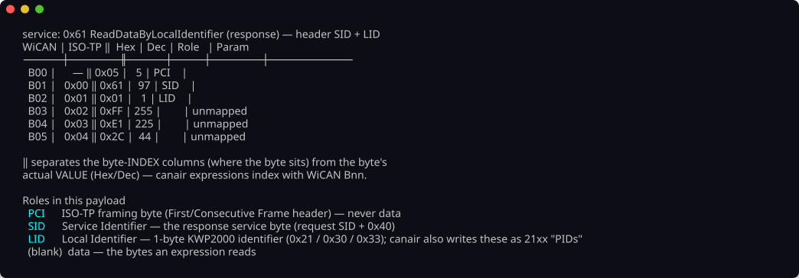
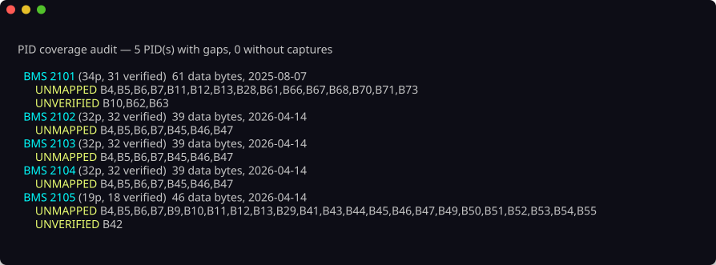

# 6. Analyze

You have captures; now work out **which byte is which signal**. This is the core
of reverse-engineering, and it's a *reasoning* process, not a single command:

1. **Inspect** — see which bytes actually move.
2. **Reason** — from what the ECU is, and how the byte behaves, form a hypothesis
   about what it could be.
3. **Test** — check that hypothesis against the data (a known reference, a
   plausible range, correlation) *without* committing anything.
4. **Confirm or reject**, then move to the next byte.

canair's analysis tools support each of those steps, and all work over your saved
captures — no live car needed. Below is the workflow, worked through on a real
example: finding vehicle speed.

## First, two families of signal: continuous vs discrete

Before reasoning about any byte, work out which of two broad families it belongs
to — they need **different analysis tools**, and getting this wrong sends you
down a dead end (e.g. Pearson-correlating a gear enum against speed).

**Continuous signals** are a value on a number line: speed, voltage, current,
temperature, RPM, state-of-charge. Neighbouring values are meaningfully "close"
(91 km/h is just above 90) and arithmetic is valid — mean, min/max, and a linear
`scale·x + offset` all make sense. This is what Pearson correlation, `--stats`
distributions, and linear fits are built for. Most powertrain sensor bytes are
continuous.

**Discrete signals** take a value from a fixed set where the number is a *label*,
not a quantity:

- **Enums / state machines** — gear, drive mode, fan level, charge state. A small
  set of distinct integers; `Drive=3` is not "one more than" `Neutral=2`, so
  spacing, averages, and min/max are meaningless.
- **Bitfields / flags** — doors, locks, lights, relays: individual bits toggle
  independently with discrete physical events.
- **Counters / checksums** — a rolling frame counter or CRC: high-distinct, but
  with *no* physical quantity to decode. Recognise them so you don't waste time
  fitting a scale to noise.

Body and comfort modules (BCM/IGPM/HVAC) are mostly discrete; powertrain modules
(BMS/MCU/VCU) are mostly continuous, with a few enum/flag bytes (contactor state,
drive mode) mixed in.

Why the split drives the tooling:

| | Continuous | Discrete (enum / flag) |
|---|---|---|
| Fingerprint | many values, smooth motion | few distinct values, or independent bit toggles |
| Right statistic | Pearson/Spearman `r`, mean/stdev, variance-F | Cramér's V, mutual information, edge timelines |
| canair tools | `hunt`, `correlate`, `decode --stats` / `--corr` / `--discriminate` | `correlate --method cramers_v`, `investigate --bits` / `--events`, `decode --discriminate` |
| Model | linear `expression` (scale + offset) | `type: enum`/`bitmask` + a `values:`/`bits:` map |

Your quickest classifier is the `--stats` **`distinct`** count over a varied
drive: 2–8 distinct values (or a byte whose bits toggle independently) is almost
certainly an enum/flag; dozens of smoothly-changing values is continuous.

The worked example below (finding vehicle speed) follows the **continuous** path.
The **discrete** path — typed parameters and categorical statistics — is covered
under [Categorical signals](#categorical-signals-modes-flags-schedules) further
down.

## Step 1 — Inspect: which bytes move?

A byte that never changes across your captures can't be a live signal. Start by
diffing captures of the same PID taken in different conditions:

```bash
canair captures uds MyECU:2101 --diff --state driving   # byte-level diff across a drive
canair captures uds MyECU:2101 --diff --rulers          # overlay the byte-index ruler
```

(`captures`, `correlate`, and `hunt` are `uds`/`can` groups — `uds` is the
diagnostic domain and the default, so a bare `canair captures MyECU:2101 …`
works too; the `can` kind targets raw broadcast-CAN frame logs.)

The bytes that **change** are your candidates. The ones highlighted as you go
from parked to driving are the ones carrying motion-related information. Map the
raw payload to byte indices so you know exactly what you're looking at:

```bash
canair bix --annotate 6101FFFF… --ecu MyECU --pid 2101
```



> Byte indexing is the classic trap — WiCAN, ISO-TP, and Torque all count bytes
> differently, and there are transport (PCI) bytes you must not read across. See
> [Byte indexing](../concepts/byte-indexing.md).

### Reading several PIDs at the same instant

`--diff` shows one PID's history. When the question is *"what did **that** byte do
while **this** other signal changed?"*, step through the captures instead and let
canair stack the PIDs into one time-joined frame:

```bash
canair captures uds "MyECU:2101,2102" --step              # two PIDs, stacked
canair captures uds "HVAC:220100,2201A0,2201A2" --step    # duct temps vs compressor
canair captures uds "VCU:2101 BMS:2101" --step            # across two ECUs
```

Each frame is anchored on a capture timestamp, with the other PIDs joined to the
nearest capture within `--join-tol` (10s by default — wide enough to span a full
round-robin `monitor` cycle over several ECUs). A block shows its `Δt` from the
anchor, and a PID
with no capture in range is reported rather than hidden, so you always know
whether you are looking at a real simultaneous reading.

Inside the stepper: `←`/`→` (or `h`/`l`) move between frames, `↑`/`↓` (or `k`/`j`)
scroll a tall frame (`g`/`G` for its first/last frame, `Home`/`End` for the view's
top/bottom), **`p`** adds/removes signals from the comparison,
**`J`** changes the join tolerance,
**`V`** switches rendering (`signals` drops the hex to fit more PIDs; `changed`
shows only parameters whose value actually moved), **`tab`** picks a block so
**`e`** can annotate that capture, and **`?`** lists every key.

**Moving between frames keeps your scroll position.** A stacked frame is usually
taller than the terminal, so scroll down to the byte you care about — three PIDs
down, halfway through the hex — and then step with `←`/`→`: the view stays put and
the numbers underneath change. That is what makes the stepper a comparator rather
than a pager. The frame's timestamp is repeated in the status bar so you still
know *when* you are while the frame header is scrolled out of sight, and `Home`
takes you back to it.

This is the fastest way to watch an event-driven signal: put the *known* signal
(a compressor flag, a door state) in the same frame as the *candidate* byte, then
walk the frames across the moment it switched.

**Leave yourself landmarks.** Press **`e`** on any frame to annotate that capture
("Heating started", "pressed the lock button"), then **`s`** to jump straight back
to it later: the jump list shows every session in scope, newest first, with its
noted captures nested underneath. That turns a long recording into a set of named
moments — write the note while you remember what you did, and the analysis becomes
"jump to the event, then step outward". A note also survives into
`canair captures --sessions`, so it is a durable record rather than a UI bookmark.

To see what's still undecoded across a whole ECU (or PID), `canair coverage`
audits every parameter expression against the longest captured payload and lists
the **unmapped** and partially-decoded bytes:



## Step 2 — Reason: what could this byte be?

Before guessing offsets, ask *what would this ECU need to report?* An ECU's job
constrains what its bytes can plausibly be:

- A **BMS** reports cell voltages, pack current (signed, symmetric about zero),
  temperatures (slow-moving), state-of-charge (0–100%).
- An **MCU/inverter** reports motor RPM and torque (signed, symmetric under
  regen), and several component temperatures.
- A **body module** (BCM/IGPM) reports mostly *discrete* things — lights, locks,
  doors — as **bitfields**, not continuous values.

The byte's *behaviour* narrows it further:

- **Range & distribution** — a value bounded 0–100 is likely a percentage; one
  symmetric about zero is likely signed (torque, current).
- **Speed of change** — temperatures drift slowly; loads/currents jump fast.
- **Distinct values** — a handful of discrete integers is an enum/state machine,
  not an analog reading.

For our example: on a drive, a byte that sits at 0 while parked and climbs
smoothly to ~100 as you accelerate, staying non-negative, looks a lot like
**speed in km/h**.

`canair decode --stats` gives you the distribution to reason from:

```bash
canair decode MyECU 2101 --stats                  # n / distinct / mean / stdev per byte
canair decode MyECU 2101 --stats --group-by state # per-state means (parked vs driving)
```

## Step 3 — Test the hypothesis (without committing)

Now confirm it with evidence. The single strongest lever is **correlation against
a signal you already trust** — often a known signal on *another* ECU captured
during the same drive.

**If you have a reference signal**, let `canair hunt` do the search for you: it
sweeps every byte offset and interpretation on the PID, correlates each against
the reference, and reports the best fit with a physical-unit guess:

```bash
canair hunt uds MyECU:2101 --against ESC:22C101:REAL_SPEED_KMH
# → B12  r=0.99  y = 1.00·x + 0.3   (looks like km/h)
```

> `ESC:22C101:REAL_SPEED_KMH` here is a *known* speed signal from the bundled
> Ioniq profile, used purely to illustrate. On your car the reference is
> whatever signal *you've* already verified (or an external anchor like
> GPS-logged speed) — the technique is the same.

**Reference an external log** (a calibrated meter, a GPS speed track, a
grid-voltage export) with `--against-file` — a two-column `timestamp,value` CSV,
joined by nearest timestamp exactly like an on-bus reference. This is the only
way to hunt a signal that has *no* correlate on the bus:

```bash
canair hunt uds MyECU:2101 --against-file gps_speed.csv    # vs an external track
canair correlate uds --against-file grid_voltage.csv       # rank every byte vs it
```

> The CSV must be on the same absolute wall clock as your captures. A
> relative/zero-based log will parse but join to nothing (reported as `n=0`).

An `r` near 1.0 on byte 12 with a ~1:1 linear fit is strong evidence that **byte
12 is speed in km/h**. That's our hypothesis, confirmed by data.

**If you're not sure what relates to what**, let `canair correlate` rank *every*
strong cross-signal relationship in the drive, then focus:

```bash
canair correlate uds --overlap --state driving   # which PIDs share a timeline?
canair correlate uds --state driving              # rank the strongest pairs
```

**Test an exact expression** against all captures without editing any YAML:

```bash
canair decode MyECU 2101 --try "SPEED_KMH=[B12]" --stats
canair decode MyECU 2101 --try "SPEED_KMH=[B12]" --corr ESC:22C101:REAL_SPEED_KMH
canair decode MyECU 2101 --plot               # interactive: sweep interpretations visually
```

`--plot` opens an interactive explorer: step through parameters/bytes, sweep
`u8`/`i16`/`f32` interpretations and endianness, apply transforms, and read off
the equivalent WiCAN expression — all against your saved captures, no car needed:


**Dump the raw bytes** as a `timestamp × byte-offset` matrix when you want to
analyze outside canair (a spreadsheet, a scratch script) — the structured escape
hatch, CSV by default or `--json`:

```bash
canair decode MyECU 2101 --dump-bytes                 # CSV to stdout (PCI skipped)
canair decode MyECU 2101 --dump-bytes --json          # same, as JSON
```

## When a signal fights back: confounders, plausibility, independence

Correlation-based tools fail on a signal that has **no clean anchor on the bus** —
one that's masked by a dominant driver, or that correlates with nothing at all.
Three levers for those cases (all worked through in the
[AC input voltage case study](../case-studies/ac-input-voltage.md)):

```bash
# Confounder control: rank by the PARTIAL correlation, with a nuisance signal
# regressed out — surfaces a link hidden behind a dominant driver.
canair hunt uds OBC:2101 --against-file grid_v.csv --control OBC:2101:OBC_DC_A

# Physical plausibility: no reference at all — flag bytes whose scaled value
# lands in a named band (mains RMS/peak, line freq, 12V rail, HV pack).
canair hunt uds OBC 2101 --physical --state charging

# Active-but-independent: rank bytes that separate by state yet DON'T track a
# named driver (the fingerprint of AC voltage vs charge current).
canair investigate MyECU 2101 --independent-of OBC:2101:OBC_DC_A --state charging
```

!!! tip "800 V pack or a non-EU grid? Tune the bands first"
    The physical bands default to a ~400 V EV on a 230 V / 50 Hz grid, so on a
    mismatched car/grid the `--physical` scan can silently find nothing. For an
    **800 V architecture** set the HV band in your profile —
    `physical_bands: { hv_pack: [450, 850] }` (see
    [Profiles](../concepts/profiles.md)); if you're **not on a 230 V / 50 Hz
    grid** set your region — `canair config set grid_region US` (see
    [Configuration](../reference/config.md)) — before running `--physical`.


## The one-shot shortcut: `investigate`

`canair investigate` bundles inspect + reason + correlate into a single report:
for every varying byte it tells you whether a parameter already maps it, how well
it separates across vehicle states, and its strongest relationship to a
co-captured signal — with a unit guess. Point it at an unknown PID first:

```bash
canair investigate MyECU 2101 --state driving
canair investigate MyECU 2101 --bits     # rank toggling bits too (body/discrete signals)
canair investigate MyECU 2101 --events   # edge timeline for narrated door/lock/hood captures
```

Each byte also carries a one-word **triage class** — `constant` / `counter` /
`checksum` / `enum` (a live analog byte is left unlabelled) — a cheap first read
of what kind of field it is. And a **probable multi-byte words** section flags
adjacent `[Bn:Bn+1]` pairs shaped like a scaled 16-bit value (a near-constant
high byte next to a full-range low byte) — the exact shape a scaled voltage takes
when it hides across a byte boundary.

It's the fastest way to get oriented; the individual tools above are how you
follow up on what it surfaces.

### Odometers, hour meters and cycle counts: `--counters`

The triage `counter` class above spots a *fast rolling* byte — a message/alive
counter cycling through every value. It cannot find the counters you actually want
a name for, because they are slow: an odometer or an operating-hours tally does not
move at all within one recording session, so it looks **constant** to every tool on
this page, correlation included.

`--counters` asks the one question that finds them — *which byte windows only ever
go up across the entire capture history?*

```bash
canair investigate MyECU 2101 --counters
canair investigate MyECU 2101 --counters --unmapped-only   # skip what's already verified
```

It sweeps 1–4-byte windows in both endiannesses (a real odometer is usually 3 or 4
bytes) and sorts hits into **accumulators** (rise within sessions too — odometer,
cumulative Ah/Wh), **cycle counters** (flat inside every session, stepping only
between them — ignition/trip counts) and **run timers** (ramp and reset each
session, tracking wall-clock — uptime).

Two things to know before you trust a hit:

- **Evidence is reported in bits.** Each clean rise with no fall is one bit, so a
  window at 3 bits rose three times and never fell — a 1-in-8 coincidence, i.e. a
  *lead*, not a finding. A long-running accumulator scores in the hundreds. Don't
  write a parameter off a handful of bits; go get more captures across more days.
- **Don't scope it.** This is the one analysis that wants your whole history —
  `--state`/`--since` shorten the horizon, and the horizon is the evidence.

The magnitude usually identifies the signal on sight: a 3-byte window reading
`70047 → 73048` over four months is a kilometre odometer, and one reading
`21268317 → 22312975` at roughly one per second is an operating-second counter.
Cross-check a distance candidate against your cluster odometer, and confirm it is
*distance* and not *time* by checking that its ratio to a known time counter is not
constant.

See [Analysis commands](../concepts/analysis-commands.md#counters-the-one-thing-correlation-cannot-find)
for the fingerprint table and the ISO-TP window details.

## Categorical signals: modes, flags, schedules

This is the **discrete** family from the taxonomy above — a fan level, a climate
mode, a gear, a day-of-week schedule mask. The worked speed example took the
continuous path; here the numeric spacing is meaningless (`Drive=3` isn't "one
more than" `Neutral=2`), so Pearson correlation and the variance-F don't apply.

canair models these as **typed** parameters (`enum`/`bitmask`/`ascii`/`date`/
`struct`) and analyzes them with *categorical* statistics — see
[Typed signals](../concepts/typed-signals.md) for the model. The analysis levers:

```bash
# "Which byte is the fan setting?" — rank by nominal association, not linear r
canair correlate uds HVAC --against HVAC:220100:HVAC_FAN_LEVEL --method cramers_v

# "Which byte separates the power states?" — Cramér's V for typed params
canair decode HVAC 220100 --discriminate state

# Once defined as an enum, see the transitions as labels over time
canair investigate HVAC 220100 --events --field HVAC_FAN_LEVEL
# → 10:05:00  fanMAX (45) → fan1 (40)
```

`--method cramers_v` / `--method mutual_info` treat each distinct value as a
nominal category — the right question for a mode/flag/enum byte. For a body
module's discrete bits, `investigate --bits` and `--events` remain the entry
points.

## Decoding "set" commands: toggle and diff

Some of the most interesting signals aren't *read* — they're **written** by the
car (the head unit setting a preheat schedule, a clock, a charge timer). Two
things make these harder:

1. On a gateway-isolated OBD port you often can't *sniff* the write itself (see
   [Broadcast frames](../concepts/broadcast-frames.md) for the raw-CAN path when
   you can).
2. The result is a **structured record** (day-mask + time), not one byte.

The reliable device-only workflow is **toggle → re-read → diff**:

```bash
# 1. Read the DID that stores the setting, before the change
canair read BCM:22B00C --save --label "schedule: before" --state ready

# 2. Change the setting on the car (set preheat to a different day/time)

# 3. Re-read the same DID, after
canair read BCM:22B00C --save --label "schedule: after" --state ready

# 4. Diff the two payloads to see exactly which bytes moved
canair captures uds BCM:22B00C --diff

# 5. Model the changed bytes as a typed field and test it
canair pids upsert-param BCM 22B00C PREHEAT_DAYS B3 \
    --type bitmask --bit 0=mon --bit 1=tue --bit 2=wed --bit 3=thu \
    --bit 4=fri --bit 5=sat --bit 6=sun --unverified
canair decode BCM 22B00C
```

For a whole schedule record, define a `struct` param whose ordered `fields:`
cover the day-mask, hour, and minute — `investigate --events --field` then reads
each schedule change as one logical `{days=…, hour=…, minute=…}` transition.

## Be rigorous

A hypothesis is a hypothesis until the data confirms it. Don't accept a byte
because it "looks about right" — check the range, the distribution, correlation
against a known reference, and physical plausibility across states. State your
confidence honestly. This is exactly why the next step starts every new parameter
as **unverified**.

> The full reasoning toolkit — thermal-mass tricks, signed/symmetry tests,
> conservation laws (P ≈ V·I), enum/counter fingerprints, endianness sweeps — is
> documented in depth in the `reverse-engineer-signal` agent skill
> (`.claude/skills/reverse-engineer-signal/`). This page is the human-facing tour of
> the same workflow.

> **See it fight back:** [Finding the hidden AC input voltage](../case-studies/ac-input-voltage.md)
> is a full case study of this workflow applied to a signal that resisted every
> obvious approach — a good read for *why* the rigor above matters.

---

You now have a confident hypothesis (*"byte 12 of `MyECU:2101` is speed in
km/h"*). Next: **[7. Define & verify →](07-define-and-verify.md)** turns it into a
stored parameter.
