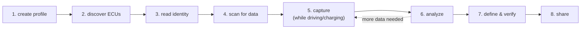

# Bring your own car

The bundled Ioniq profile is just an **example**. canair's tooling is
vehicle-agnostic — this journey takes you from *nothing* to decoded, verified
diagnostic signals for **your** car, stored in a [profile](../concepts/profiles.md)
you can share.

You don't need to know your car's PIDs in advance. The discovery and scan
commands are a **write path**: they populate the profile as they find things, so
the profile grows itself as you work.

## The arc

| Step | You do | Result |
|---|---|---|
| [1. Create a profile](01-create-profile.md) | `canair profile create` | An empty, valid profile bundle |
| [2. Discover ECUs](02-discover-ecus.md) | `canair discover --register` | Every responding ECU written into `ecus/` |
| [3. Read identity](03-identity.md) | `canair identity` / `discover --identify` | Part numbers, versions, VIN |
| [4. Scan for data](04-scan.md) | `canair scan` | Which PIDs/DIDs each ECU answers |
| [5. Capture](05-capture.md) | `canair query … --save` | Real payloads with driving/charging context |
| [6. Analyze](06-analyze.md) | `decode` / `correlate` / `hunt` / `investigate` | Which byte *is* which signal |
| [7. Define & verify](07-define-and-verify.md) | `canair pids upsert-param`, `coverage` | Named parameters in `ecus/` |
| [8. Share](08-share.md) | `canair wican autopid write` | WiCAN AutoPID JSON; a profile to contribute |

## It's a loop, not a line

Reverse-engineering is iterative. You'll often capture some data, analyze it,
realize you need *different* conditions (accelerating vs. coasting, plugged vs.
charging), and go capture again. That's expected — the dashed arrow above.

The rule of thumb: **read and capture freely, define conservatively.** Mark new
parameters `--unverified` until you've confirmed them against a known reference
or across enough captures, then promote them. See
[Define & verify](07-define-and-verify.md).

## Before you start

Make sure you've done [Getting started](../getting-started/install.md) — canair
installed, your dongle configured, and `canair status` reporting a reachable
device. Everything below assumes that works.

---

Next: **[1. Create a profile →](01-create-profile.md)**
