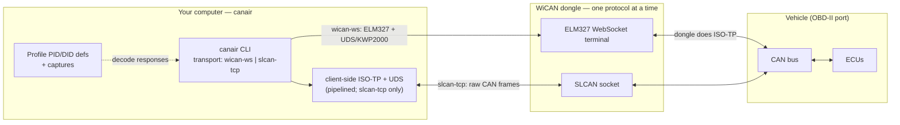

# Architecture

canair **never talks CAN directly** — it reaches the bus through the WiCAN dongle
over one of two explicitly-selected transports. Responses are parsed and decoded
into named parameters using the active [profile](profiles.md)'s definitions.

## How it connects

## Transports

The device runs **one protocol at a time** — check with `canair status`.

- **`slcan-tcp`** (default) — a raw SLCAN frame stream over TCP. canair performs
  ISO-TP + UDS itself, pipelined across ECUs. Works on **any WiCAN (Pro or
  classic)** or gateway. Also powers `canair sniff`.
- **`wican-ws`** (Pro only) — the WiCAN Pro's ELM327 emulation over a WebSocket;
  the *dongle* performs ISO-TP.

`slcan-tcp` is the canonical default because it runs on both hardware variants.
Select a transport with `--transport` or the config `transport:` block.

## Protocols

- **UDS** (ISO 14229) — body/comfort ECUs.
- **KWP2000** (ISO 14230) — powertrain ECUs (BMS, VCU, MCU, OBC).
- **ISO-TP** (ISO 15765-2) — multi-frame transport underneath both.
- **SLCAN-over-TCP** and **ELM327 AT** — the host↔dongle link.

canair auto-selects UDS vs. KWP2000 per ECU based on the profile registry or an
on-device probe.

## Two data domains

canair handles two parallel kinds of data:

- **Diagnostics** — request/response UDS/KWP2000 (mature: `query`/`scan`/`dtc`/…).
- **Raw frames** — passively-sniffed broadcast traffic no request elicits
  (`canair sniff`).

Both are first-class. The transport layer treats the WiCAN as a *replaceable* way
to reach the bus, so a future SocketCAN or replay backend could slot in behind
the same interface.
