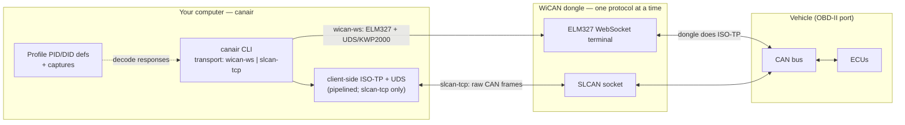

# Architecture

canair **never talks CAN directly** — it reaches the bus through an adapter
(a WiCAN dongle, or a generic ELM327 clone) over one of several
explicitly-selected transports. Responses are parsed and decoded into named
parameters using the active [profile](profiles.md)'s definitions.

## How it connects

```mermaid
flowchart LR
    subgraph host["Your computer — canair"]
        cli["canair CLI<br/>transport: wican-ws | slcan-tcp"]
        defs["Profile PID/DID defs<br/>+ captures"]
        isotp["client-side ISO-TP + UDS<br/>(pipelined; slcan-tcp only)"]
    end
    subgraph wican["WiCAN dongle — one protocol at a time"]
        ws["ELM327 WebSocket terminal"]
        slcan["SLCAN socket"]
    end
    subgraph car["Vehicle (OBD-II port)"]
        bus["CAN bus"]
        ecus["ECUs"]
    end
    cli -->|"wican-ws: ELM327 + UDS/KWP2000"| ws
    cli --> isotp
    isotp <-->|"slcan-tcp: raw CAN frames"| slcan
    ws <-->|"dongle does ISO-TP"| bus
    slcan <--> bus
    bus <--> ecus
    defs -.->|"decode responses"| cli
```

## Transports

The device runs **one protocol at a time** — check with `canair status`.

- **`slcan-tcp`** (default) — a raw SLCAN frame stream over TCP. canair performs
  ISO-TP + UDS itself, pipelined across ECUs. Works on **any WiCAN (Pro or
  classic)** or gateway. Also powers `canair sniff`.
- **`wican-ws`** (Pro only) — the WiCAN Pro's ELM327 emulation over a WebSocket;
  the *dongle* performs ISO-TP.
- **`elm327-tcp`** — a **generic ELM327 adapter** over a plain TCP socket: the
  $10 WiFi clones (Kiwi, vLinker, OBDLink, no-name dongles) and the
  [ELM327-Emulator](../development/offline-testing.md)'s `-n` mode. No WiCAN,
  no HTTP config API — just the ELM327 terminal on a TCP port (usually 35000);
  the *dongle* performs ISO-TP.

`slcan-tcp` is the canonical default because it runs on both WiCAN hardware
variants. Select a transport with `--transport` or the config `transport:` block.
The ELM327 transports (`wican-ws`, `elm327-tcp`) share one ELM327 protocol
engine — only the byte channel (WebSocket vs. plain TCP) differs — so every
command works identically over each.

!!! note "WiCAN is recommended; third-party dongles are best-effort"
    The `elm327-tcp` transport lets you use any generic ELM327 clone, but the
    **WiCAN is the best-tested adapter** for this project and is recommended.
    Cheap clones vary in firmware quality, can't be guaranteed reliable, and are
    especially likely to fall short on **newer vehicles** that depend on long
    multi-frame ISO-TP payloads and **extended (29-bit) addressing**. See
    [Connect your dongle](../getting-started/connect-device.md#using-a-generic-elm327-clone-no-wican).

## Protocols

- **UDS** (ISO 14229) — the modern diagnostic protocol.
- **KWP2000** (ISO 14230) — the older protocol some ECUs still speak.
- **ISO-TP** (ISO 15765-2) — multi-frame transport underneath both.
- **SLCAN-over-TCP** and **ELM327 AT** — the host↔dongle link.

Which ECUs speak which protocol is **vehicle-specific** — canair auto-selects UDS
vs. KWP2000 per ECU based on the profile registry or an on-device probe. (On the
bundled Ioniq, for example, the powertrain ECUs — BMS, VCU, MCU, OBC — are
KWP2000 while body/comfort ECUs are UDS; another car may split differently.)

## Two data domains

canair handles two parallel kinds of data:

- **Diagnostics** — request/response UDS/KWP2000 (mature: `read`/`scan`/`dtc`/…).
- **Raw frames** — passively-sniffed broadcast traffic no request elicits
  (`canair sniff`).

Both are first-class. The transport layer treats the WiCAN as a *replaceable* way
to reach the bus — a generic ELM327 clone (`elm327-tcp`) already slots in behind
the same interface, and a future SocketCAN or replay backend could too.
