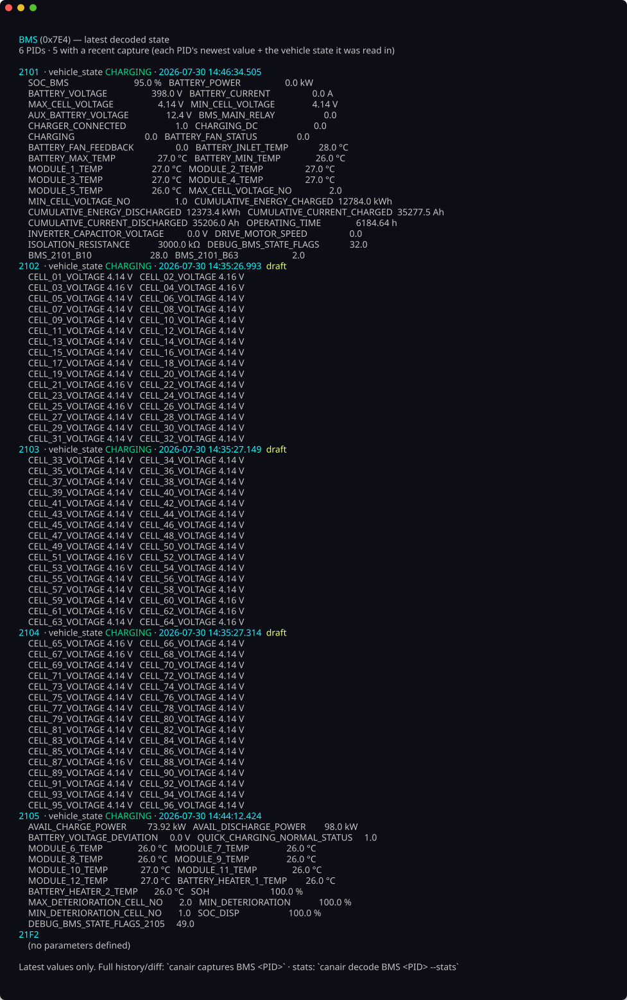

# Read live data

With your [dongle connected](connect-device.md) and `canair status` happy, read
some real data. These examples target the **bundled 2017 Ioniq profile**, so the
ECU names (`BMS`, `MCU`, …) are Ioniq-specific — but `discover` works on any car.

```bash
# See every ECU responding on the bus (works on any vehicle)
canair discover

# Read the battery ECU's main PID, decoded into named parameters (Ioniq)
canair read BMS:2101

# Read all known parameters for an ECU
canair read BMS

# Read specific named parameters across ECUs
canair read --param SOC_BMS BATTERY_VOLTAGE BATTERY_POWER

# Watch a value live — refreshes, highlights changed bytes and the params they decode
canair monitor BMS:2101

# Read Diagnostic Trouble Codes across every ECU
canair dtc --all
```

`canair read` uses a small [selector syntax](../concepts/query-mini-language.md)
(`ECU:PID`) and can run multi-step pipelines over one session.

Once you've captured some readings, `canair ecu <ECU> pids` shows each PID's
latest decoded value — raw payloads turned into named, unit-bearing parameters:



## Watch it live

`canair monitor` refreshes in place, highlighting the bytes that change and the
parameters they decode. Here it is polling the **battery** with the car in READY
mode — SOC, pack voltage/current, cell voltages, and module temperatures, with
changed values highlighted and the live payload byte-diff underneath:


It monitors several ECUs at once, too. This cross-ECU view watches the
**drivetrain** — the VCU (gear/drive-mode, vehicle state) alongside the MCU
(motor speed/torque, inverter temperatures) — and auto-detects the vehicle state
(`READY`) from the decoded values while recording (`● REC`):


## On a different car

`discover` will list *your* car's ECUs, but `BMS:2101` and the other named reads
depend on the active profile's definitions — which, on a fresh profile, are
empty. That's the whole point of the next section:

**→ [Bring your own car](../bring-your-own-car/overview.md)** builds a profile for
your vehicle so these named reads work for *you*.
